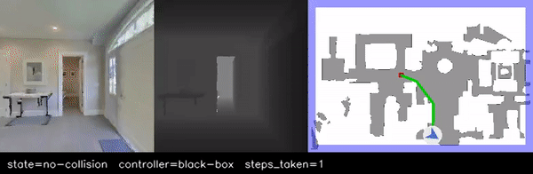
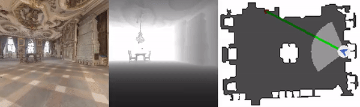

# 16-711 KDC Final Project
## Safety Verification for Black-Box Controllers

RL Blackbox Controller
<p align="center">  </p>


RL Blackbox + Safety Verification
<p align="center">  </p>


# Setup

1. Install anaconda or miniconda and create an environment:

```
    conda create -n KDC python=3.6 cmake=3.14.0
    python -m pip install -r requirements.txt
```

### Dependencies


Install [Habitat-Sim](https://github.com/facebookresearch/habitat-sim):
```
   git submodule add git@github.com:zubair-irshad/habitat-sim.git
   cd habitat-sim
   python setup.py install --headless --with-cuda
```

Install [Habitat-Lab](https://github.com/facebookresearch/habitat-lab/):
```
   git submodule add git@github.com:zubair-irshad/habitat-lab.git
   cd habitat-lab
   python -m pip install -r requirements.txt
   python -m pip install -r habitat_baselines/rl/requirements.txt
   python -m pip install -r habitat_baselines/rl/ddppo/requirements.txt
   python setup.py develop --all
```

#### Note

Download [these](https://drive.google.com/drive/u/0/folders/1XLQPFkO6xDjlMXJ5IGr-lIS0iIqrwWmh) folders to ```habitat-lab```.

### Test installation

1. Download [these](http://dl.fbaipublicfiles.com/habitat/habitat-test-scenes.zip) examples and extract them to `habitat-lab/data`. It should look like this:

```
habitat-lab/data
  -- datasets/
        -- pointnav
  -- scene_datasets/
        -- habitat-test-scenes/
            -- files.glb
            -- files.navmesh
```

2. Run example:

```
    cd habitat-lab
    export GLOG_minloglevel=2   # these exports are just to suppress verbosity
    export MAGNUM_LOG=quiet
    python examples/example.py
```

If you see a message like: `episode ended after n steps` then you're all set.

3. Visualize example:

```
    cd habitat-lab
    python examples/shortest-path-example.py
```

Videos are saved to: `examples/images/xx/trajectory.mp4`.

## Test baseline

1. Download these [models](https://drive.google.com/drive/folders/1MRiQud5ld3R_Ogfs9xi4t-yRi4MY4nhv?usp=sharing) (they're about 50-140MB). 

2. If you're using CPU run:
```
    export GLOG_minloglevel=2 
    export MAGNUM_LOG=quiet
    python run.py --exp-config config/rl_exp_cpu.yaml
```
 otherwise, use ```config/rl_exp_gpu.yaml``` or to test a simple controller use ```config/simple_exp.yaml```

3. It should create a directory ```out/controller``` containing videos like this one:

<p align="center">  </p>

## Relevant tutorials

- This [tutorial](https://aihabitat.org/docs/habitat-sim/rigid-object-tutorial.html#continuous-control-on-navmesh) implements continous control, might be useful for our project
